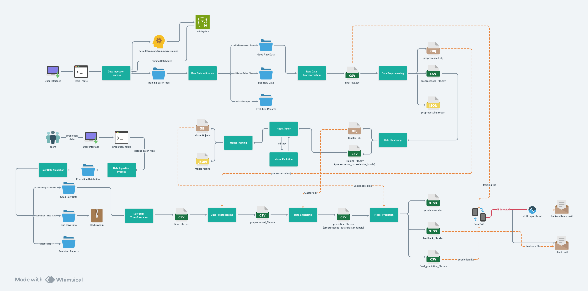
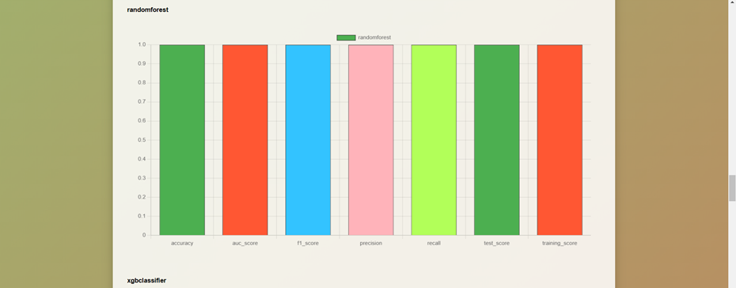
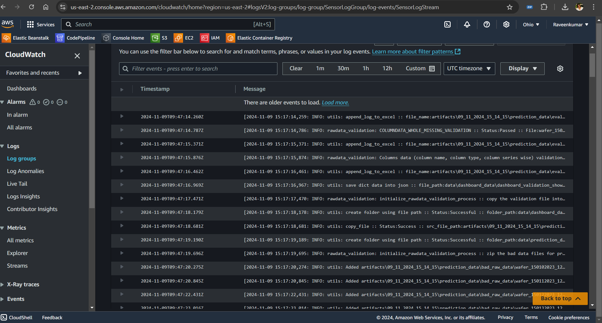

# Wafer Fault Detection System

## Overview

The **Wafer Fault Detection System** is designed to streamline the semiconductor manufacturing process by detecting faults in wafers early. This repository contains everything needed to train, validate, and monitor a machine learning model that predicts wafer faults based on sensor data.

- Project Presentation
[Presentation](<project_documents/Project Presentation.pdf>)

- HLD
[HLD](project_documents/HLD.pdf)

- LLD 
[LLD](project_documents/LLD.pdf)

- Wireframe
[Wireframe](project_documents/WIREFRAME.pdf)

## Table of Contents

- [Overview](#overview)
- [Project DataFlow](#ProjectDataFlow)
- [Getting Started](#getting-started)
- [Dashboards](#dashboards)
- [Data Drift Detection](#data-drift-detection)
- [Feedback and Continuous Improvement](#feedback-and-continuous-improvement)
- [Model Logging and Tracking](#model-logging-and-tracking)
- [Contributing](#contributing)
- [License](#license)

## Project DataFlow

##### Implemented custom pipeline which can handle seamlessly and provide better accuracy



## Getting Started

### Prerequisites

- Python 3.12 or higher
- Essential libraries (see `requirements.txt` for detailed list)

### Installation

1. Clone this repository:
   ```bash
   git clone https://github.com/your-username/wafer-fault-detection.git
   cd wafer-fault-detection
   ```

2. Install dependencies:
   ```bash
   pip install -r requirements.txt
   ```

3. Set up environment variables in the `.env` file (reference `.env.example`).


## Usage

1. **Training the Model**: To start training the model, run the /train route::
   ```bash
   python app.py
   ```

2. **Prediction**: Use the prediction dashboard to upload wafer data for fault prediction:
   ```bash
   python app.py
   ```

3. **Validation Logs**: Check `validation_logs.xlsx` for details on data validation steps and issues.

4. **Predictions**: Predictions are saved in `predictions.csv`.

5. **Feedback**: After running predictions, update `feedback.csv` with client feedback for further improvements.

## Dashboards

### Main Dashboard


### Prediction Dashboard

- Provides a user-friendly interface for uploading new wafer data and viewing predictions.
- Displays prediction status, success rate, and output results.


- **Validation Logs**: Check `validation_logs.xlsx` for details on data validation steps and issues.

-**Predictions**: Predictions are saved in `predictions.csv`.


### Training Dashboard

- Real-time insights into model training.
- Displays metrics like accuracy, loss, and validation score.
- Automatically updates with each training epoch.





## Data Drift Detection

Data drift is automatically monitored and detected:
- If data drift exceeds a predefined threshold, an alert is generated.
- Notification emails are sent to both the backend and client teams to address any major drifts.
- **Backend team Alert Mail** 

- **Client team Alert Mail** 


## Feedback and Continuous Improvement

- The feedback system integrates client reviews through `feedback.csv`.
- This feedback file contains a column as confidence which is probability of outcome 
- Once feedback is incorporated, retrain the model to adapt to new data trends.
- This continuous cycle improves model accuracy and relevancy.


## Model Logging and Tracking

This project uses MLflow for experiment tracking:
1. Start the MLflow UI with:
   ```bash
   mlflow ui
   ```
2. Log model parameters, metrics, and artifacts to maintain version control.
3. Use tags (e.g., version 1.0, type: pandas) for easy categorization and tracking.


- Check the Dagshub repo:


## System Logging :
- All Application logs stored in aws-cloudwatch 



## Contributing

1. Fork the repository.
2. Create a feature branch (`git checkout -b feature/YourFeature`).
3. Commit your changes (`git commit -m 'Add YourFeature'`).
4. Push to the branch (`git push origin feature/YourFeature`).
5. Open a pull request.

## License

This project is licensed under the MIT License. See `LICENSE` for details.
